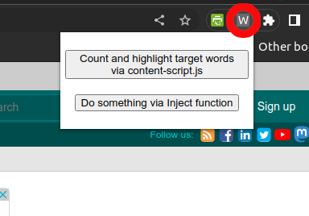
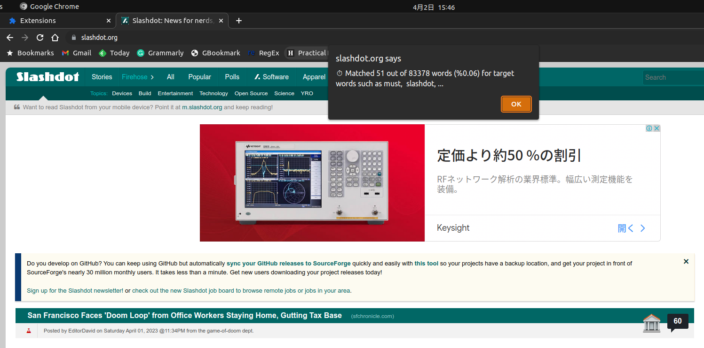

# Code for counting and highlighting target words on a web page using a Chrome extension.

Target words are listed in content-script.js in the following line

`const targetWords = ['must', 'slashdot'];`

## Installation
Make sure the Chrome extension has been [installed](https://developer.chrome.com/docs/extensions/mv3/getstarted/development-basics/#load-unpacked) and [pinned](https://developer.chrome.com/docs/extensions/mv3/getstarted/development-basics/#pin).

## Usage
Click on the W in the upper right corner of your browser (circled in red in the screenshot below)

Select `Count and highlight target words via content-script.js`

The pop up will show the word counts in the pop up window. After clicking OK the target words will be highlighted in yellow.

Select `Copy a query for ChatGPT into the clipboard using Inject function in popup.js`
The pop up will copy a query for ChatGPT based on the article. You will need to manually paste the query into ChatGPT as the OpenAI API is behind a pay wall.

## References
- [reference.mv3-content-scripts](https://github.com/GoogleChrome/chrome-extensions-samples/tree/main/functional-samples/reference.mv3-content-scripts)
- [tutorial.reading-time](https://github.com/GoogleChrome/chrome-extensions-samples/tree/main/functional-samples/tutorial.reading-time)

